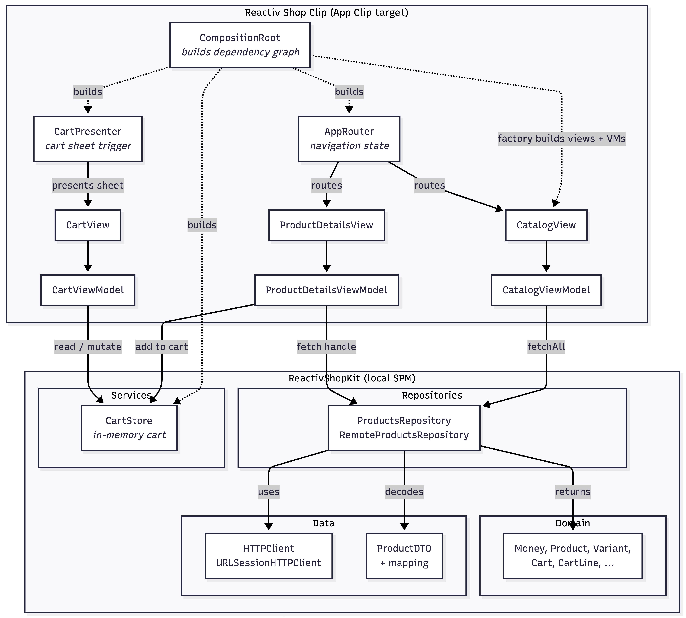

# Reactiv Shop Product Preview

A SwiftUI App Clip that loads a Shopify-style product feed, lets you browse, view details, pick a variant, and add it to a local cart.

## Setup

Requires **Xcode 26** and an iPhone or simulator running iOS 17+.

```sh
git clone https://github.com/WarTech9/shop-preview
cd "Reactiv Shop"
open "Reactiv Shop.xcodeproj"
```

The local SPM package (`Packages/ReactivShopKit`) is already wired into the project — Xcode resolves it on first open.

## Configuration

The product feed URL is supplied via an Info.plist key `ProductFeedURL` and is read at launch.

### Simulating App Clip invocations

The Clip parses `https://shop.reactivapp.com/...` URLs. To test invocation routing in the simulator, set the `_XCAppClipURL` environment variable in the scheme:

1. Edit Scheme → `Reactiv Shop Clip` → Run → Arguments → Environment Variables.
2. Add `_XCAppClipURL` with one of:
   - `https://shop.reactivapp.com/collections/all` → catalog
   - `https://shop.reactivapp.com/product/unisex-hoodie` → product details
   - `https://shop.reactivapp.com/product/does-not-exist` → not-found state

Unset it for cold-launch (drops you on the catalog).

## Build & run

Two schemes:

| Scheme | What it runs |
|---|---|
| `Reactiv Shop Clip` | The App Clip — this is the deliverable |
| `Reactiv Shop` | Stub main app (not implemented) |

Pick `Reactiv Shop Clip` and **⌘R**. The Clip launches into the catalog populated from the live product feed.

To build from the command line:

```sh
xcodebuild -project "Reactiv Shop.xcodeproj" \
  -scheme "Reactiv Shop Clip" \
  -destination 'platform=iOS Simulator,name=iPhone 17' build
```

To run the test suite:

```sh
cd Packages/ReactivShopKit && swift test   # 103 tests, 14 suites
```

## Architecture

App Clips ship as a lightweight surface of a full app. This one is built with that
in mind: shared functionality lives in a local SPM package (`ReactivShopKit`),
with the App Clip target as one consumer. A future main app can pull from the
same package without rework.

The package is organized into four layers, each with a single responsibility:

- **Domain**: value types (`Product`, `Variant`, `Money`, `Cart`, …). Foundation only.
- **Repositories**: `ProductsRepository` protocol and its `RemoteProductsRepository`
  actor implementation. Returns Domain types; depends on Data for raw bytes.
- **Data**: `HTTPClient`, DTOs, and JSON mapping. Owns the wire format.
- **Services**: `CartStore` (in-memory cart state). No SwiftUI.

The App Clip target holds everything UI-shaped: views, view models, navigation
(`AppRouter`), the cart sheet trigger (`CartPresenter`), URL invocation handling
(`InvocationURLParser`), and the `CompositionRoot` that wires it all up at `@main`.
The package never imports SwiftUI; the target reaches the package only through
repository / store interfaces.



## Tradeoffs & assumptions

- **Local SPM package over a single target.** More initial setup, but cleanly separates Domain / Repositories / Data / Presentation. Easier to extend or share with a future main app.
- **No DI framework.** `CompositionRoot` + closure factories. Easy to read for three views with limited dependencies. A larger app might require a dedicated dependency container.
- **Single-currency cart.** `Cart.add(_:of:)` throws `CartError.currencyMismatch` rather than silently coercing.

## Non-goals

The brief explicitly reserves extension work for the live session, so the Clip is intentionally minimal:

- No checkout, payments, or post-cart flow.
- No persistence. Cart is in-memory and clears on Clip dismissal.
- Main app target is a placeholder; all functionality lives in the Clip.
- Currency conversion is not handled; the cart enforces single-currency via `CartError.currencyMismatch`.
